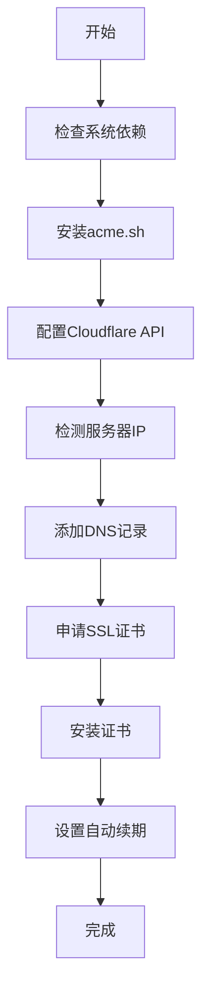

# 一键SSL证书申请脚本
```bash
bash <(curl -Ls https://raw.githubusercontent.com/ryty1/nat_ssl/refs/heads/main/ssl.sh)
```
🚀 **自动化SSL证书申请工具** - 支持IPv4/IPv6双栈，完全自动化DNS解析和SSL证书申请

## ✨ 功能特色

### 🎯 **核心功能**
- **一键操作** - 输入域名和API Token即可完成所有配置
- **自动DNS解析** - 自动检测服务器IP并添加A/AAAA记录到Cloudflare
- **自动SSL证书** - 使用DNS验证方式自动申请Let's Encrypt证书
- **自动续期** - 设置cron任务，证书到期前自动续期

### 🌐 **网络支持**
- **IPv4支持** - 自动检测IPv4地址并添加A记录
- **IPv6支持** - 自动检测IPv6地址并添加AAAA记录  
- **双栈支持** - 同时支持IPv4和IPv6的服务器
- **NAT VPS友好** - 不需要任何端口权限，适合NAT VPS

### 🎨 **用户体验**
- **动态动画** - 美观的等待效果和状态显示
- **彩色输出** - 清晰的状态标识（成功/跳过/失败）
- **智能检测** - 避免重复添加已存在的DNS记录
- **详细日志** - 完整的操作记录和错误排查信息

## 📋 **系统要求**

### **支持的操作系统**
- Ubuntu/Debian
- CentOS/RHEL
- 其他Linux发行版

### **必需的工具**
- `curl` - HTTP请求工具
- `jq` - JSON处理工具
- `dig` - DNS查询工具
- `cron` - 定时任务服务

*脚本会自动检测并安装缺失的依赖*

## 🚀 **快速开始**

### 1. **下载脚本**
```bash
wget https://your-domain.com/ssl_blog_setup_fixed.sh
chmod +x ssl_blog_setup_fixed.sh
```

### 2. **获取Cloudflare API Token**
1. 访问 [Cloudflare API Tokens](https://dash.cloudflare.com/profile/api-tokens)
2. 点击 **"Create Token"**
3. 选择 **"Edit zone DNS"** 模板
4. 在 **"Zone Resources"** 中选择 **"Include All zones"**
5. 点击 **"Continue to summary"** → **"Create Token"**
6. 复制生成的Token

### 3. **运行脚本**
```bash
bash ssl.sh
```

### 4. **按提示操作**
- 输入您的域名（支持子域名）
- 粘贴Cloudflare API Token
- 等待自动完成所有配置

## 📖 **使用示例**

### **运行过程示例**
```bash
$ bash ssl.sh

[INFO] 检测到系统类型: debian
[STEP] 步骤1: 检查并安装必要工具
[INFO] 所有依赖已安装，跳过安装步骤

[STEP] 步骤2: 安装acme.sh SSL证书工具
[INFO] acme.sh 已存在，跳过安装

[STEP] 步骤3: 配置Cloudflare DNS API
您的域名 (支持子域名，如: blog.example.com): blog.example.com

[INFO] [KEY] 由于NAT VPS限制，我们使用API Token方式进行授权
请输入您的Cloudflare API Token: your_token_here

[STEP] 步骤4: 添加域名DNS解析记录
[INFO] 检测服务器IP地址...
[INFO] 检测到IPv4地址: 1.2.3.4
[INFO] 检测到IPv6地址: 2001:db8::1

[WAIT] 添加IPv4 A记录: blog.example.com → 1.2.3.4 [OK]
[WAIT] 添加IPv6 AAAA记录: blog.example.com → 2001:db8::1 [OK]

[STEP] 步骤5: 申请SSL证书
[WAIT] 正在申请SSL证书并验证DNS记录 [OK]
[INFO] SSL证书申请成功

[STEP] 步骤6: 安装SSL证书到指定路径
[INFO] SSL证书安装完成

[STEP] 步骤7: 设置SSL证书自动续期
[INFO] SSL证书自动续期已设置完成

[INFO] [COMPLETE] SSL证书申请和配置完成！
```

## 📁 **输出文件**

### **证书文件位置**
```
/root/cert/
├── private.key      # 私钥文件
├── fullchain.crt    # 完整证书链
└── cert.crt         # 证书文件
```

### **网站目录**
```
/var/www/your-domain.com/    # 网站根目录
```

## ⚙️ **配置说明**

### **支持的域名格式**
- **主域名**: `example.com`
- **子域名**: `blog.example.com`
- **多级子域名**: `api.v1.example.com`

### **DNS记录类型**
- **A记录**: IPv4地址解析
- **AAAA记录**: IPv6地址解析

### **SSL证书**
- **颁发机构**: Let's Encrypt
- **验证方式**: DNS验证
- **有效期**: 90天
- **自动续期**: 到期前30天自动续期

## 🔧 **高级配置**

### **自定义证书路径**
编辑脚本中的 `CERT_DIR` 变量：
```bash
CERT_DIR="/path/to/your/certs"
```

### **自定义网站目录**
编辑脚本中的 `WEB_DIR` 变量：
```bash
WEB_DIR="/path/to/your/website"
```

### **手动续期证书**
```bash
~/.acme.sh/acme.sh --renew -d your-domain.com --force
```

## 🛠️ **故障排查**

### **常见问题**

#### **1. API Token权限不足**
```
错误: 无法获取Zone ID
解决: 确保API Token包含 "Zone:DNS:Edit" 权限
```

#### **2. 域名未添加到Cloudflare**
```
错误: 域名不存在于Cloudflare
解决: 先将域名添加到Cloudflare并更新NS记录
```

#### **3. DNS记录添加失败**
```
错误: DNS记录添加失败
解决: 检查API Token权限和域名状态
```

#### **4. SSL证书申请失败**
```
错误: SSL证书申请失败
解决: 检查DNS记录是否正确，等待DNS传播
```

### **日志文件**
- **acme.sh日志**: `~/.acme.sh/acme.sh.log`
- **临时日志**: `/tmp/acme_temp.log`

### **手动检查DNS记录**
```bash
# 检查A记录
dig A your-domain.com

# 检查AAAA记录  
dig AAAA your-domain.com

# 检查TXT记录（验证时）
dig TXT _acme-challenge.your-domain.com
```

## 🔒 **安全说明**

### **API Token安全**
- Token仅用于DNS操作，权限最小化
- 建议定期轮换API Token
- 不要在公共场所输入Token

### **证书安全**
- 私钥文件权限设置为600
- 证书文件存储在安全目录
- 定期备份证书文件

## 📊 **技术架构**

### **工作流程**


### **核心组件**
- **acme.sh** - SSL证书申请工具
- **Cloudflare API** - DNS记录管理
- **Let's Encrypt** - 免费SSL证书颁发
- **cron** - 自动续期任务

## 🤝 **贡献指南**

### **报告问题**
如果遇到问题，请提供：
- 操作系统版本
- 错误信息截图
- 相关日志文件

### **功能建议**
欢迎提出新功能建议：
- 支持更多DNS服务商
- 添加Web界面
- 支持通配符证书

## 📄 **许可证**

本项目采用 MIT 许可证 - 详见 [LICENSE](LICENSE) 文件

## 🙏 **致谢**

- [acme.sh](https://github.com/acmesh-official/acme.sh) - 优秀的SSL证书申请工具
- [Let's Encrypt](https://letsencrypt.org/) - 免费SSL证书服务
- [Cloudflare](https://www.cloudflare.com/) - DNS服务提供商


---

*最后更新: 2025年9月18日*
